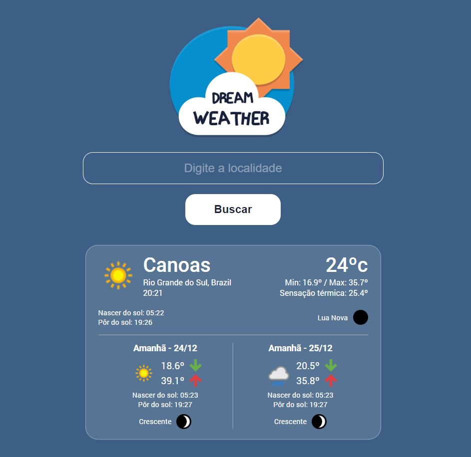

# DreamWeather - Previsão do tempo

Projeto desenvolvido com intuíto de prática em ReactJS. A ideia era desenvolver uma aplicação de consulta da previsão do tempo, utilizando uma API, e retirando o máximo de informações possíveis para o projeto.

# Implementações
- Estilização da página
- Pesquisa por localidade
- Consulta e obtenção dos dados via WeatherAPI
- Exibição dos dados
- Busca funcional com a tecla 'Enter'
- Tratamento de horários para formato 24 horas
- Tratamento relativo às fases da lua
- Tratamento de erros
- Responsividade

# Tecnologias utilizadas:
- HTML
- CSS
- JavaScript
- ReactJS
- Styled Components
- Axios
- WeatherAPI
- Git/GitHub

[Clique aqui para acessar o projeto](https://axlbr.github.io/react-dreamweather/)

# Contato
gabrieltoby@gmail.com
